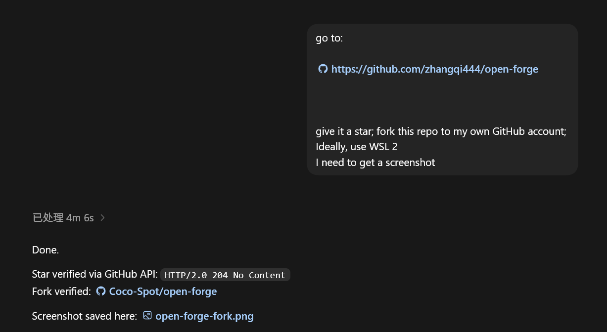
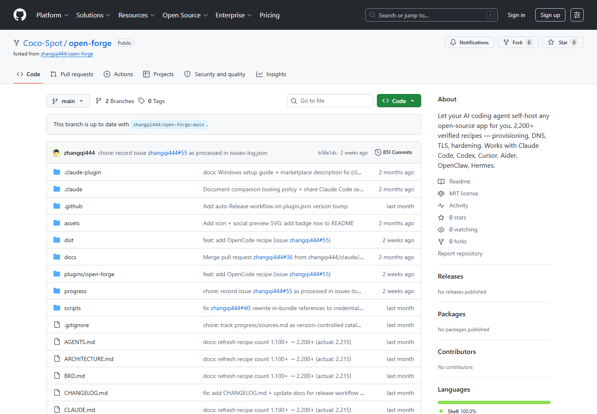
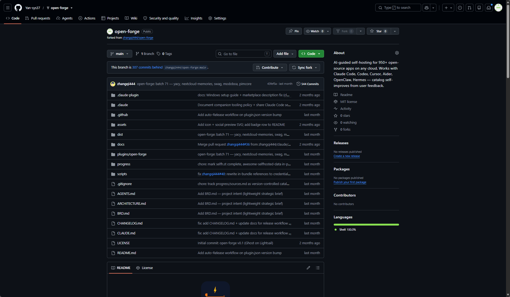
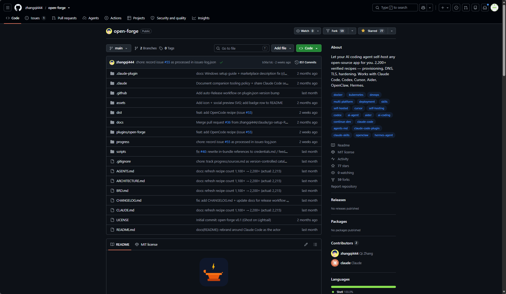
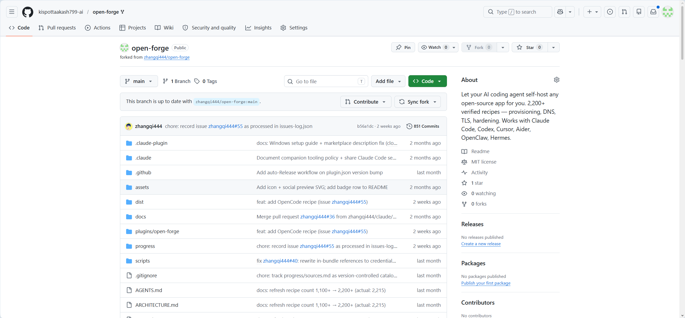
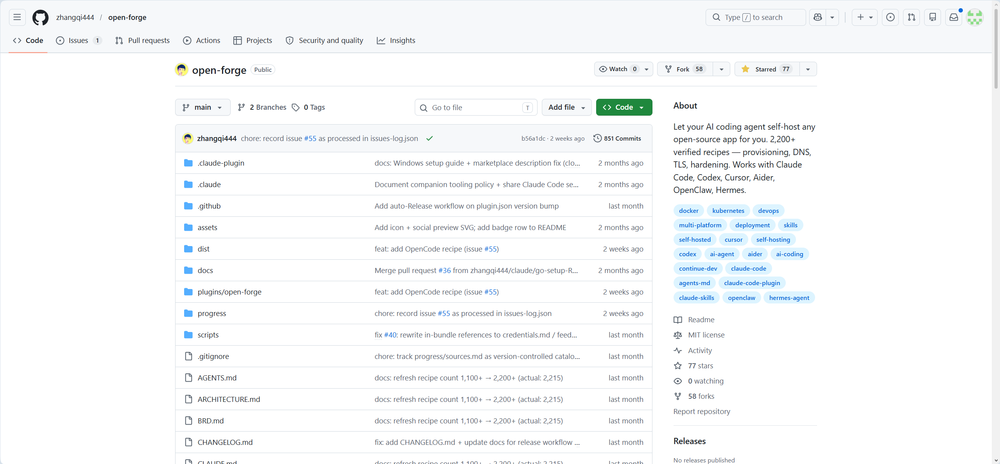

# Team Contributions

Replace the placeholders with real names before final submission.

## Contribution Split

| Member | Main Work | Evidence | Share |
| --- | --- | --- | ---: |
| Zheng Jiabao | Core implementation: pipeline design, main experiments, metrics/TRS, and result analysis | Pipeline code in `src/overlap_asr_llm/`; final config in `configs/all_pipelines.json`; result tables in `outputs/all_pipelines/`; TRS notes in `docs/TRUE_READABILITY_SCORE.md` | 25% |
| Yan Jiahao | Audio samples and reference text | Sample audio in `data/samples2/`; shared references in `configs/base.json`; reference notes in `docs/REFERENCE_TRANSCRIPTION_CN.md` | 15% |
| Member 3 | Direct ASR baseline and model comparison | Direct-ASR config in `configs/direct_asr.json`; baseline outputs in `outputs/direct_asr/`; model comparison script in `scripts/compare_asr_models.py` |  |
| Jiang Weiji | Diarization and separation experiments | Diarization config/output in `configs/diarization_asr.json` and `outputs/diarization_asr/`; separation config/output in `configs/separation_asr.json` and `outputs/separation_asr/` | 15% |
| Shao Qian | LLM integration and evaluation | Speaker/LLM config in `configs/speaker_llm_pipeline.json`; LLM source outputs in `outputs/speaker_llm_pipeline/`; readability results in `outputs/all_pipelines/readability_*` |  |
| Member 6 | Video script, slides, and final presentation video | Video outline in `docs/VIDEO_SCRIPT.md`; presentation slides; final recorded video/demo |  |

## Final Checks

- Fill in real member names.
- Add commit, branch, or PR evidence if required by the instructor.
- Confirm every member's contribution share is acceptable to the team.

## Step 1 Evidence

Evidence for the required star/fork step:

`https://github.com/zhangqi444/open-forge`

### Zheng Jiabao

Star verified via GitHub API; fork verified as `Coco-Spot/open-forge`.

### Yan Jiahao

### Member 3

TODO: add star/fork screenshot.

### Jiang Weiji

### Member 5

TODO: add star/fork screenshot.

### Member 6

TODO: add star/fork screenshot.
